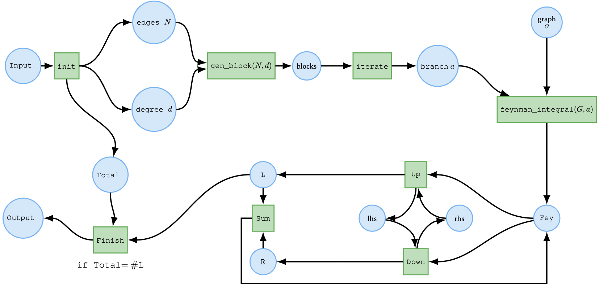
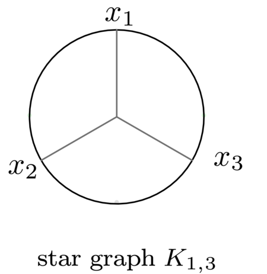

# GromovWitten Computation using GPI-Space

<div align="center">
  
</div>

[](LICENSE)
[](https://www.gpi-space.de/)
[](https://isocpp.org/)
[](https://github.com/wbhart/flint2)

A powerful package for computing generating series for tropical Hurwitz numbers of elliptic curves via mirror symmetry and Feynman integrals.

## 📋 Table of Contents

- [Overview](#overview)
- [Features](#features)
- [Installation](#installation)
- [Usage](#usage)
- [License](#license)

## 🌟 Overview

The GromovWitten package provides a comprehensive solution for computing generating series for tropical Hurwitz numbers of elliptic curves through mirror symmetry and Feynman integrals. Through a correspondence theorem, it also determines Hurwitz numbers in the context of algebraic geometry.

### Features

- Computation of generating series for tropical Hurwitz numbers
- Integration with GPI-Space for Feynman integral computations
- Support for Gromov-Witten invariants calculation
- C++ and XML implementation for high performance

## 🚀 Installation

### Prerequisites

- Modern C++ compiler (C++17 or later)
- [GPI-Space](https://www.gpi-space.de/) (version 24.12)
- [Flint](https://github.com/wbhart/flint2) library

### Installing Dependencies

1. Install Spack package manager following the [official instructions](https://spack.readthedocs.io/en/latest/getting_started.html)
2. Install required packages:

```bash
spack install gpi-space@24.12
spack install flint
```

### Installing GromovWitten

1. Clone the repository:

```bash
git clone https://github.com/singular-gpispace/gspc-gromovwitten.git
cd gspc-gromovwitten
```

2. Configure the build:

   - Modify `CMakeLists.txt` and `install.sh` to include paths to GPI-Space and flint libraries
3. Launch GPI-Space monitor (required for logging):

```bash
spack load gpi-space@24.12
gspc-monitor --port 9876 &
```

4. Run the installation:

```bash
./install.sh
```

## 💻 Usage

Before running any GPI-Space application, ensure the logger service is running. The application requires the following command-line arguments:

- `--log-host`: Hostname for the logger service (usually "localhost")
- `--log-port`: Port number for the logger service
- `--gspc-home`: Path to GPI-Space installation
- `--nodefile`: Path to file containing hostnames
- `--rif-strategy`: Strategy for bootstrapping (usually "ssh")
- `--topology`: Worker configuration (format: "worker-name:num-workers")

### Example: Computing Feynman Integral

<div align="center">
  
</div>

Compute the Feynman Integral of degree d=4:

```bash
time ~/gpi/try_gpi/gspc-gromovwitten/bin/bin/feynman \
  --gspc-home ~/singular-gpispace/spack/opt/spack/linux-ubuntu22.04-skylake/gcc-11.3.0/gpi-space-24.12-jz6b4m6ql54fmhkpq6gbico2neic3kd5/ \
  --nodefile ~/gpi/try_gpi/gspc-gromovwitten/nodefile \
  --rif-strategy ssh \
  --topology "worker:7" \
  --N 6 \
  --degree 4 \
  --graph "{{1, 2}, {1, 3}, {1, 4}, {2, 3}, {2, 4}, {3, 4}}" \
  --log-host localhost \
  --log-port 9876
```

#### Expected Output

When running the computation, you should see output similar to this:

```bash
I: starting base sdpa components on waas 36103 1596330...
I: starting top level gspc logging demultiplexer on waas
   => accepting registration on 'TCP: <<waas:45265>>, SOCKET: <<waas:\0bbe38>>'
I: starting agent: agent-waas 36103 1596330-0 on rif entry point waas 36103 1596330
I: starting worker workers (parent agent-waas 36103 1596330-0, 7/host, unlimited, 0 SHM) with parent agent-waas 36103 1596330-0 on rif entry point waas 36103 1596330
terminating drts-kernel on waas 36103 1596330: 1596378 1596366 1596354 1596372 1596360 1596348 1596384
terminating agent on waas 36103 1596330: 1596340
terminating logging-demultiplexer on waas 36103 1596330: 1596335
feynman_degree: 20736
```

#### Alternative Logging Setup

If you don't have access to the GPI-Space monitor GUI, you can redirect the output to a file:

```bash
# Create and redirect output to monitor.txt
rm -f monitor.txt && touch monitor.txt && \
cd /path/to/gpi-space/bin && \
stdbuf -oL -eL ./gspc-logging-to-stdout.exe --port 9876 >> monitor.txt 2>&1
```

## 📄 License

This project is licensed under the MIT License - see the [LICENSE](LICENSE) file for details.

---

<div align="center">
  <sub>Built with ❤️ by the GromovWitten team</sub>
</div>
